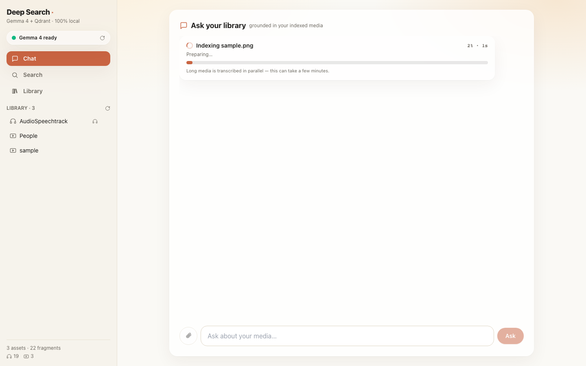
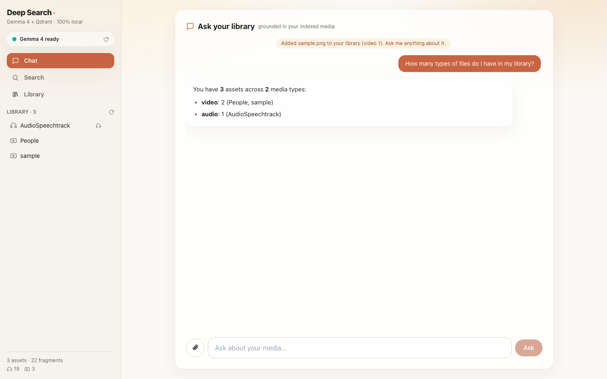
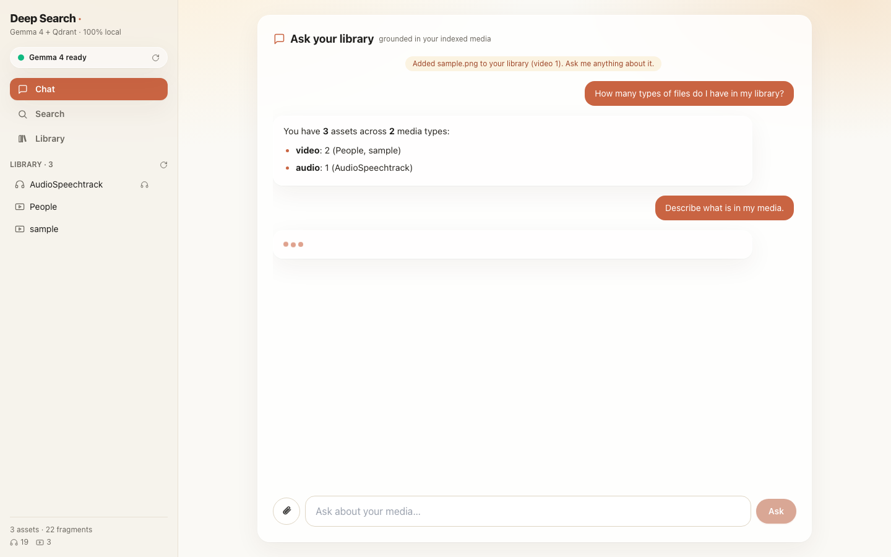
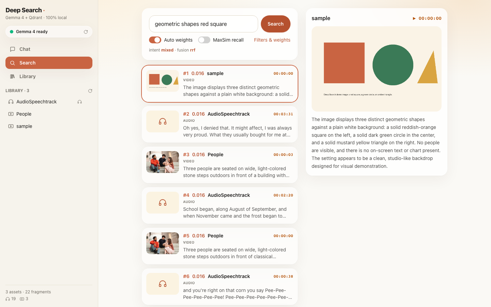
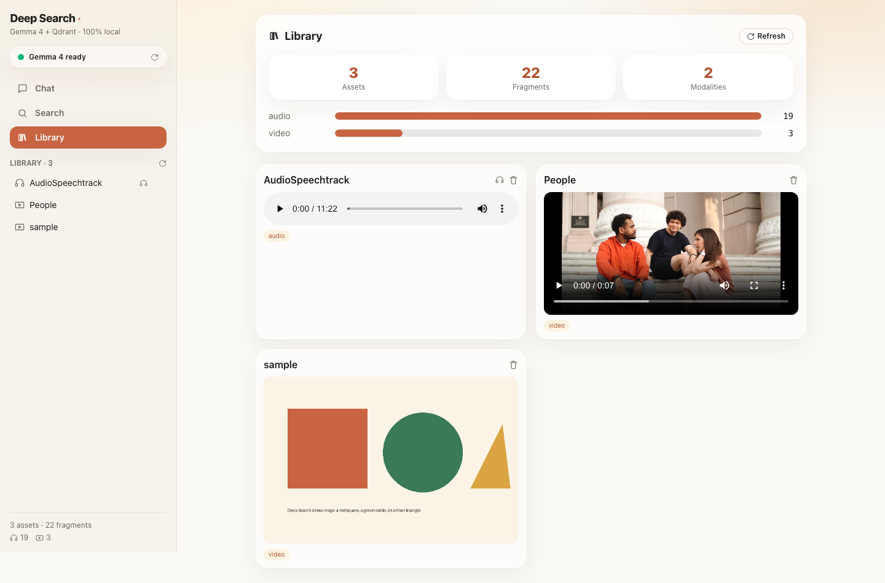

<div align="center">

# Deep Search in Media Library
### Cross-modal natural-language search over local video, audio & text — powered by **Gemma 4** and **Qdrant** multivectors.

[](.github/workflows/ci.yml)
[](pyproject.toml)
[](LICENSE)
[](#privacy)
[](docs/E2E_WALKTHROUGH.md)

*Find the exact second a moment happens — by describing it in plain English.*

</div>

---

## What it does

Drop in hours of local recordings. Ask:

> *"Find the chart showing the budget increase right when the crowd starts cheering."*

Deep Search returns the **exact timestamp**, jumps the player straight to it, and lets you
**chat** about what happens next — all running **entirely on your machine**. No cloud, no API
keys, no data leaving the device.

It unifies three modalities — **video frames, audio, and text** — into a single searchable
space, so one natural-language query retrieves across all of them at once.

## Highlights

- **Gemma 4 (local, via Ollama)** — native vision **and** audio understanding; no separate
  Whisper/OCR. Also drives query-intent analysis, reranking and RAG.
- **Qdrant named vectors** — one collection, three named spaces
  (`text_descriptions`, `video_frames`, `audio_chunks`), payload-indexed for instant filtering.
- **Second-accurate retrieval** — fragment-level indexing maps every hit back to its exact
  offset for pinpoint playback.
- **Cross-modal fusion** — RRF or intent-weighted score fusion across all three spaces.
- **Temporal RAG chat** — grounded follow-ups like *"what was said right after the blue car
  appeared?"*
- **Privacy-first** — Ollama + embedded Qdrant; nothing is transmitted externally.
- **Runs with zero weights** — a deterministic stub backend powers the full pipeline in CI
  and offline dev.

## Screenshots

A full narrated [walkthrough video + step-by-step guide](docs/E2E_WALKTHROUGH.md) is generated by
the Playwright E2E suite. Highlights:

| Chat (home) | Live ingest |
|:---:|:---:|
|  |  |
| **Grounded answer** | **Sources (timestamped)** |
|  |  |
| **Search** | **Library** |
|  |  |

## Architecture at a glance

```
ingest:  media → scene keyframes / 30s audio chunks / captions
              → Gemma 4 describes & transcribes  → one unified text-embedding space
              → Qdrant (named vectors + payload offsets)

query:   text → safety filter → Gemma intent → embed → per-space prefetch
              → fusion (RRF/weighted) → Gemma rerank → timestamped results + RAG chat
```

> **Why describe-then-embed?** Gemma 4 is a *generative* model, so its raw image/audio
> activations are not aligned with its text space. We have Gemma **describe** each frame and
> audio chunk to text, then embed everything in **one** space — so a text query truly searches
> across modalities. Full rationale, gap analysis and requirements coverage in
> [`docs/ARCHITECTURE.md`](docs/ARCHITECTURE.md).

## Documentation

- [`docs/ARCHITECTURE.md`](docs/ARCHITECTURE.md) — design & rationale, advantages, gap analysis
  vs. the original proposal, and the full requirements-coverage matrix.
- [`docs/HOW_IT_WORKS.md`](docs/HOW_IT_WORKS.md) — end-to-end pipeline walkthrough, setup, usage,
  configuration, CLI, testing, and troubleshooting.

## Quick start

### Prerequisites
- macOS (Apple Silicon recommended) or Linux
- [`uv`](https://docs.astral.sh/uv/) · [`ffmpeg`](https://ffmpeg.org/) · [Ollama](https://ollama.com) ≥ 0.30

```bash
# 1. Install
make setup            # uv venv + editable install (+ dev tools)

# 2. Pull the models (≈10 GB for gemma4:e4b)
make model            # ollama pull gemma4:e4b && nomic-embed-text

# 3. Launch the backend + frontend (two terminals)
make api              # FastAPI  → http://localhost:8000
make web              # Next.js  → http://localhost:3000
```

No GPU / models yet? Run the backend against the deterministic stub:

```bash
DEEPSEARCH_USE_STUB=true make api    # then: make web
```

### CLI

```bash
uv run deepsearch ingest ./data/media --category meetings   # index a folder
uv run deepsearch search "the chart with the budget spike"  # one-off search
uv run deepsearch stats                                      # collection stats
```

## Usage

1. **Ingest** — open the *Ingest* tab, drop video/audio/`.srt`/`.vtt`/text files, pick a
   category, click **Ingest**. Files are segmented, described by Gemma 4, and indexed.
2. **Search** — type a natural-language query. Leave *Auto weights* on to let Gemma route the
   intent, or open the accordion to set vector weights and modality/category filters manually.
3. **Jump** — pick a result from the dropdown; the player seeks to the exact second.
4. **Chat** — ask follow-up questions; answers are grounded in that asset's time-ordered
   transcript.

## Configuration

All settings live in [`config/default.yaml`](config/default.yaml) and can be overridden by
environment variables (see [`.env.example`](.env.example)). Common ones:

| Variable | Default | Purpose |
|----------|---------|---------|
| `DEEPSEARCH_GEMMA_MODEL` | `gemma4:e4b` | Multimodal model (`e2b`/`e4b`/`12b`/…) |
| `DEEPSEARCH_EMBED_MODEL` | `nomic-embed-text` | Unified-space embedder |
| `DEEPSEARCH_QDRANT_URL` | *(empty)* | Set to use a Qdrant server instead of local mode |
| `DEEPSEARCH_USE_STUB` | `false` | Run without weights (CI / offline) |

### Optional: Qdrant as a server
```bash
docker compose up -d
export DEEPSEARCH_QDRANT_URL=http://localhost:6333
```

## Project layout

```
src/deepsearch/
├── config.py            layered settings (YAML + env)
├── logging_utils.py     loguru + in-memory ring buffer
├── models/              gemma (client + health + retry) · safety (filter + sanitizer)
├── ingestion/           media_probe · video · audio · asr (whisper) · text · pipeline
├── vectorstore/         schema · store (named + MaxSim multivectors)
├── query/               intent · fusion · rerank · search engine
├── rag/                 chat — library-wide grounded RAG (deterministic counts/summary)
├── api/                 FastAPI (health · upload · ingest SSE · ask stream · search · media · delete)
└── cli.py               typer CLI (ingest · search · stats · reset · serve · health)
web/                     Next.js frontend (Apple-glass chat · cream/amber)
├── app/                 layout · page (sidebar shell) · globals.css
├── components/          Chat · Sidebar · Search · Library · ResultCard · MediaPlayer
└── lib/api.ts           typed API client (+ SSE streaming)
e2e/                     Playwright walkthrough (spec · config) → screenshots + video
config/                  default.yaml
scripts/                 ingest.py · run_app.py
docs/                    ARCHITECTURE · HOW_IT_WORKS · E2E_WALKTHROUGH
tests/                   stub-backed unit + e2e suite
```

## Development

```bash
make test     # pytest (stub backend, no weights needed)
make lint     # ruff + mypy
make fmt      # ruff format + autofix
```

## Privacy

Both the model runtime (Ollama) and the vector database (embedded Qdrant) run locally. Media
binaries are never stored in the index — only file paths and timestamp offsets. The query path
applies a prompt-injection pre-filter before any lookup.

## License

[Apache-2.0](LICENSE) © 2026 Sarvesh Talele
