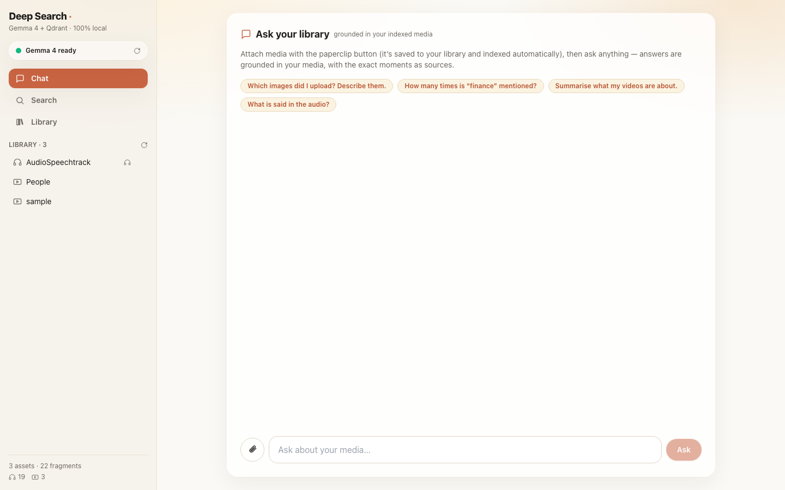
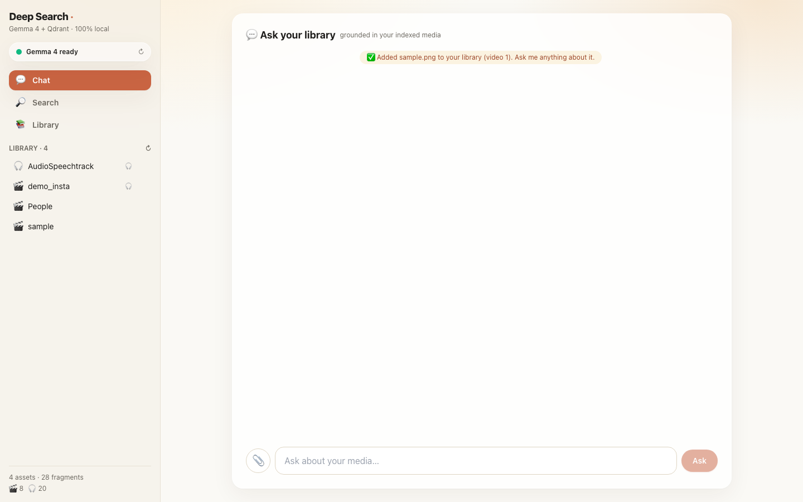
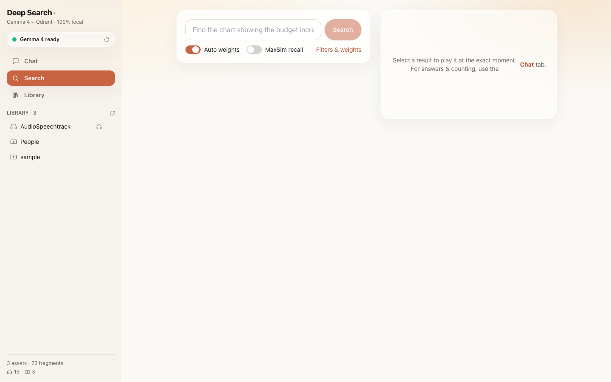

# End-to-End Walkthrough (Playwright)

This document is generated from an automated **Playwright** run that drives the live app
(FastAPI on `:8000` + Next.js on `:3000`), capturing a screenshot at each step and recording
the whole session as a video. The script waits for each streamed answer to **finish printing**
before advancing to the next frame.

- Spec: [`e2e/walkthrough.spec.ts`](../e2e/walkthrough.spec.ts)
- Video: [`docs/e2e/walkthrough.webm`](e2e/walkthrough.webm)
- Screenshots: [`docs/e2e/shots/`](e2e/shots/)

Reproduce:
```bash
make api          # terminal 1  → http://localhost:8000
make web          # terminal 2  → http://localhost:3000
cd e2e && npm install && npx playwright install chromium
npm run walkthrough
```

---

## 1. Home — chat-first interface
The app opens on the **Chat** tab. The sidebar shows the brand, a live **"Gemma 4 ready"**
health pill (polls `/api/health`), the Chat/Search/Library nav, the **Library** list, and index
stats. The main panel is "Ask your library", grounded in your indexed media.


## 2. Sidebar navigation
Three views live in the glass sidebar — **Chat** (primary), **Search**, **Library** — plus the
per-asset list with delete-on-hover.



## 3. Attach media → auto-index (live progress)
Clicking **📎** uploads a file (here a sample image) straight into the library. Ingestion runs
immediately with a live card showing the **overall %**, the current step, and an elapsed timer.
Internally: probe → keyframes/whisper → Gemma 4 description → embed → Qdrant upsert.


## 4. Indexed
A confirmation appears in chat — *"Added … to your library"* — and the sidebar library count
grows. The asset is now searchable and answerable.



## 5. Ask a library question (deterministic)
*"How many types of files do I have in my library?"* is a library/meta question — answered
**deterministically** from the asset list (each asset counted once by media type), rendered as
clean Markdown, with **no fragment sources** attached.


## 6. Ask a content question (grounded + sources)
*"Describe what is in my media."* is grounded in the retrieved fragments. The answer streams in
as Markdown; expanding **sources** reveals the exact moments (asset + timestamp) the answer is
based on — only from the relevant asset, click a chip to play it.


## 7. Search tab
The **Search** view is the raw retrieval layer: type a natural-language query to get ranked,
timestamped fragments with scores, modality/category filters, vector-weight sliders and the
MaxSim toggle.



## 8. Search results
Each hit shows its score, asset, timestamp and modality; selecting one plays the media at the
exact second (click-to-reveal player).


## 9. Library
The **Library** view lists every asset with media-type chips, players and **delete** controls,
plus collection stats (assets, fragments, modality breakdown).


---

### How it maps to the architecture
| Step | Pipeline | Code |
|------|----------|------|
| 3–4 Attach + index | offline ingestion (SSE progress) | `ingestion/pipeline.py`, `api/main.py:/ingest` |
| 5 Library question | deterministic summary | `rag/chat.py:_library_summary` |
| 6 Content question | retrieve → ground → stream | `query/search.py`, `rag/chat.py:stream`, `/api/ask/stream` |
| 7–8 Search | named-vector + MaxSim retrieval | `query/*`, `vectorstore/store.py` |
| 9 Library / delete | asset listing + removal | `/api/assets`, `/api/asset/{id}` |

See [`ARCHITECTURE.md`](ARCHITECTURE.md) and [`HOW_IT_WORKS.md`](HOW_IT_WORKS.md) for depth.
